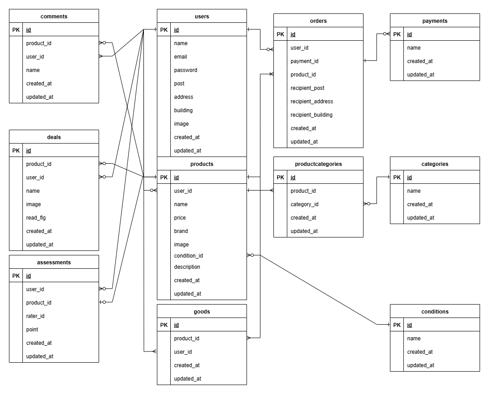

# フリーマーケットアプリ

## 環境構築

#### Docker ビルド
1. `$ git clone git@github.com:akio0121/flea-market.git`
2. DockerDesktopアプリを起動する。
3. `$ docker-compose up -d --build`

#### Laravel 環境構築
```bash
$ docker-compose exec php bash
$ composer install
```
`.env.example`ファイルを`.env`ファイルに命名を変更する。
```bash
$ php artisan key:generate
$ php artisan migrate
$ php artisan db:seed
$ php artisan storage:link
```
#### ダミーデータ

|名前|メールアドレス|パスワード|
|---|---|---|
|testA|aaa@bbb.com|aaaaaaaa|
|testB|bbb@ccc.com|bbbbbbbb|
|testC|ccc@ddd.com|cccccccc|


## 使用技術（実行環境）
- PHP 7.4.9
- MySQL 8.0.26
- Laravel 8.83.8

### ER 図



### URL
- 開発環境 http://localhost/
- phpMyAdmin http://localhost:8080/
- MailHog http://localhost:8025/
